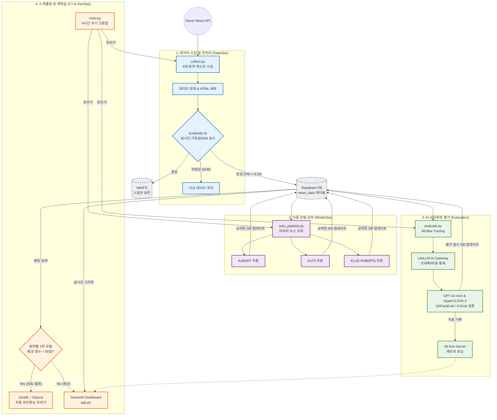

# ML-HR MLOps 파이프라인 구동 흐름도

이 문서는 ML-HR 프로젝트의 전체적인 시스템 아키텍처와 데이터 흐름(DataOps -> ModelOps -> Evaluation -> CT/DevOps)을 시각화한 다이어그램입니다.

## 주요 파이프라인 단계 설명

1. **DataOps (수집 및 차단)**
   네이버 뉴스 API에서 데이터를 가져온 뒤, `Evidently AI`를 통해 데이터 분포나 가독성에 이상이 없는지(Drift) 실시간으로 검사합니다. 정상 데이터는 Supabase와 데이터 레이크(lakeFS)에 저장됩니다.

2. **ModelOps (추론 경쟁)**
   저장된 뉴스를 바탕으로 3개의 경량 로컬 모델(`KoBART`, `KoT5`, `RoBERTa`)이 각각 요약문을 생성하고 결과를 다시 데이터베이스에 적재합니다.

3. **Evaluation (자동 평가 및 검증)**
   생성된 요약문들을 상용 대형 LLM(GPT-4o-mini 등)이 평가합니다. 이때 `LiteLLM`으로 API 트래픽을 통제하며, `QAFactEval`(무참조 사실성 검증) 기법을 활용해 환각을 잡아내고 `MLflow`에 추적 로그를 남깁니다.

4. **CT & DevOps (지속적 학습 및 모니터링)**
   스케줄러(`main.py`)가 전체 과정을 주기적으로 통제하며, 특정 분야의 1위 모델 점수가 65점 밑으로 떨어지면 성능 열화로 판단하여 `ZenML`을 통한 자동 재학습(파인튜닝)을 트리거합니다. 사용자는 이 모든 과정을 `Streamlit` 대시보드에서 실시간으로 관제합니다.
